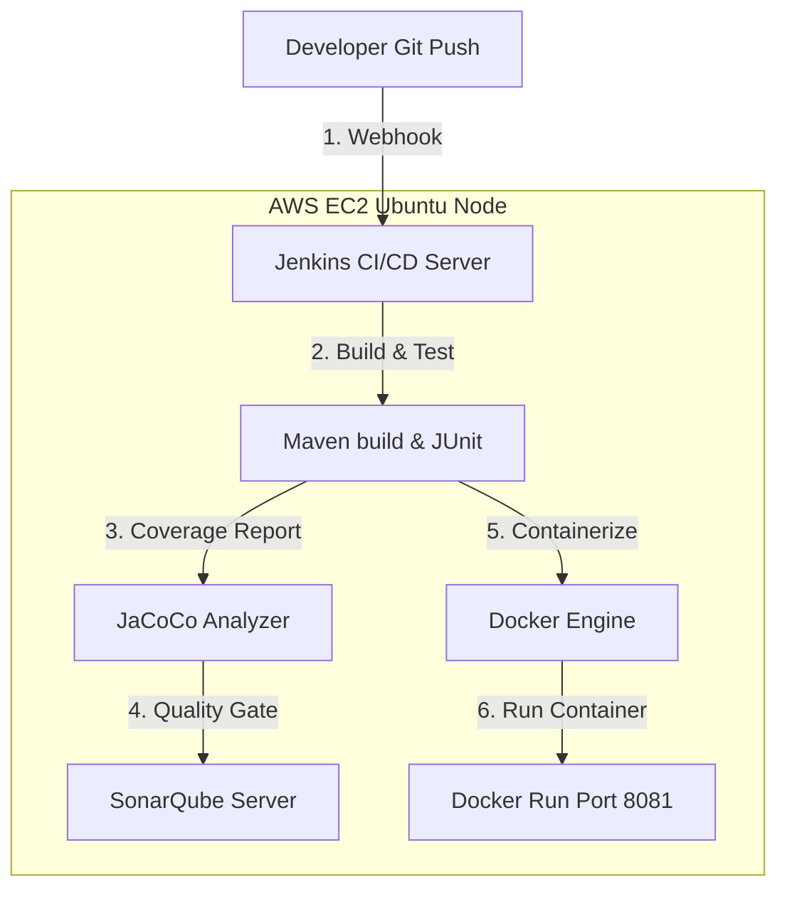

# 🚀 End-to-End DevOps Pipeline: Jenkins CI/CD, SonarQube Testing, & Docker Containerization

[](#)
[](#)
[](#)
[](#)
[](#)

This is a production-ready, database-backed **Spring Boot Java REST Application** featuring an interactive web dashboard. It serves as a comprehensive showcase of modern DevOps methodologies, utilizing a **Jenkins CI/CD Pipeline** to automate build testing and quality analysis with **SonarQube**, packaging with **Docker**, and hosting on **AWS Cloud Servers (Ubuntu)**.

---

## 🏗️ Architecture Overview

The system utilizes an enterprise 3-tier architecture with clean data boundaries:

```text
       [ Web Browser (Client UI) ]
                   │
                   ▼ (HTTP GET/POST/PUT/DELETE on Port 8081)
       [ REST Controller (TodoController) ]
                   │
                   ▼ (Business Validation)
       [ Service Layer (TodoService) ]
                   │
                   ▼ (JPA Operations)
       [ Repository Layer (TodoRepository) ]
                   │
                   ▼ (In-Memory SQL)
       [ H2 Relational Database ]
```

---

## 🛠️ DevOps Tools Integration Guide

This project is automated across a complete toolchain hosted on **AWS EC2 Ubuntu Linux**:



### 1. Docker Containerization
The application is containerized using a secure, lightweight base image:
*   **Base Image**: `eclipse-temurin:21-jre-alpine` (utilizes Alpine Linux JRE to reduce security vulnerabilities and maintain a small image size of under 130MB).
*   **Startup Configuration**: Runs the pre-compiled Spring Boot JAR as an executable runtime (`ENTRYPOINT`), mapping container port `8081` to the host port.

### 2. Jenkins Automation (CI/CD)
The automated `Jenkinsfile` executes a Declarative Pipeline running on an AWS Ubuntu node:
*   **Code Checkout**: Clones the latest branch dynamically using `checkout scm`.
*   **Compilation & Packaging**: Triggers `mvn clean package` to build the compiled JAR file.
*   **Automated Testing**: Triggers `mvn test` to run the suite of 13 Mockito and MockMvc tests, ensuring build stability.
*   **Container Lifecycle**: Automatically stops and deletes any running container (`docker stop`/`docker rm`) before building a new image and deploying the updated container.
*   **Garbage Collection**: Invokes `docker image prune -f` in the `post-always` stage to clean up dangling Docker images and preserve host disk space.

---

## 📊 SonarQube & Jenkins Integration (UI Setup Guide)

Follow these steps to configure **SonarQube** code quality analysis inside your Jenkins pipeline.

### Step 1: Set Up Project in SonarQube UI
1. Open your browser and go to your SonarQube Dashboard (usually `http://<YOUR_AWS_IP>:9000`).
2. Log in (Default credentials: `admin` / `admin`).
3. Click **Create Project** $\rightarrow$ **Manually**.
4. Enter the details:
   * **Project Display Name**: `todo-app`
   * **Project Key**: `todo-app`
5. Click **Set Up**.
6. Under *How do you want to analyze your repository?*, select **Locally**.
7. Generate a unique token:
   * Enter a name (e.g., `jenkins-token`).
   * Click **Generate** and **copy the generated token** (e.g., `sqa_a1b2c3d4...`).

---

### Step 2: Add SonarQube Credentials to Jenkins UI
To allow Jenkins to communicate with your SonarQube server:
1. Log in to your Jenkins Dashboard (usually `http://<YOUR_AWS_IP>:8080`).
2. Go to **Manage Jenkins** $\rightarrow$ **Credentials** (under Security).
3. Click **System** $\rightarrow$ **Global credentials (unrestricted)**.
4. Click **Add Credentials** (top right) and fill in:
   * **Kind**: `Secret text`
   * **Scope**: `Global`
   * **Secret**: Paste the *SonarQube token* you generated in Step 1.
   * **ID**: Write **`sonar-token`**.
   * **Description**: `SonarQube Authentication Token`.
5. Click **Create**.

---

### Step 3: Configure SonarQube Server in Jenkins Settings
1. Go to **Manage Jenkins** $\rightarrow$ **System** (Configure System).
2. Scroll down to the **SonarQube servers** section.
3. Click **Add SonarQube**.
4. Configure the details:
   * **Name**: Write exactly **`SonarServer`** (this name must match your Jenkinsfile stage).
   * **Server URL**: Enter your SonarQube address (e.g., `http://<YOUR_AWS_IP>:9000`).
   * **Server authentication token**: Select the **`sonar-token`** credential we created in Step 2.
5. Click **Save** at the bottom of the page.

---

### Step 4: Add SonarQube Analysis to your `Jenkinsfile`
To trigger the quality scan automatically in your pipeline, update your `Jenkinsfile` by adding the following stage right after the `test` stage:

```groovy
        stage('SonarQube Analysis') {
            steps {
                // Injects the SonarQube server configurations we defined in Jenkins UI
                withSonarQubeEnv('SonarServer') {
                    sh 'mvn sonar:sonar'
                }
            }
        }
```

---

## 🏃 Deployment & Running Guide

### Running Locally (Without Docker)
Make sure you have JDK 21 and Maven installed, then run:
```bash
# Run tests & verify
./mvnw clean test

# Package & start
./mvnw spring-boot:run
```
Access the application at **`http://localhost:8081/`**.

### Running inside Docker
To build the image and start the container locally:
```bash
# Package the application JAR
./mvnw clean package -DskipTests

# Build the Docker image
docker build -t todo-app .

# Run the container
docker run -d -p 8081:8081 --name todo-app-container todo-app
```

### Running on AWS Linux Ubuntu (CI/CD)
1. Push this project to your GitHub repository.
2. Spin up an **AWS EC2 Ubuntu** instance, exposing ports `8080` (Jenkins), `9000` (SonarQube), and `8081` (App) in the Security Group.
3. Install Java 21, Maven 3.9+, and Docker on the instance.
4. Create a **Pipeline** project in Jenkins, configure the Git repository link, and point to the `Jenkinsfile` at the root.
5. Click **Build Now** to execute the pipeline.
